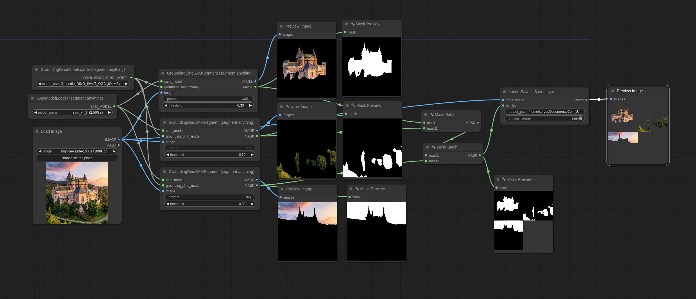
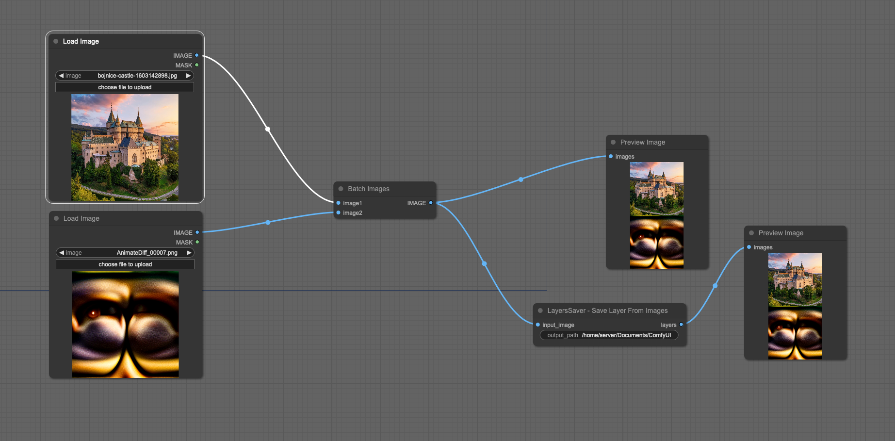

# LayersSaver - Save Layers Node for ComfyUI
These two custom nodes for ComfyUI allows you to save images into a PSD file as layers.
This can be particularly useful for graphic design, image processing, and tasks requiring manipulation of image layers.

## LayersSaver - Save Layer
This custom node for ComfyUI allows you to create layers of an image based on input masks and save them into a PSD file. The node provides flexibility to include the original image and creates separate layers for each masked region. 

### Example

You can find the example workflow [here](files/example.json)

### Features

- **Input Image Handling**: Processes a single input image with batch dimension removed.
- **Mask Application**: Applies multiple masks to the input image, creating separate layers for each masked region.
- **Original Image Inclusion**: Optionally includes the original image as a separate layer.
- **Alpha Channel Management**: Ensures the input image includes an alpha channel for transparency.
- **Dynamic PSD Naming**: Generates a unique PSD filename based on the current timestamp if not specified.
- **PSD File Creation**: Saves the resulting layers into a PSD file with specified or dynamically generated filename.

## LayersSaver - Save Layer From Images
This custom node for ComfyUI allows you to create layers of an image based on all the input images. Every image in the input batch will be saved as a separate layer in the output PSD.

### Example

You can find the example workflow [here](files/batch_layers.json)

### Features

- **Input Image Handling**: Processes a infinite bach dimension input image.
- **Alpha Channel Management**: Ensures the input image includes an alpha channel for transparency.
- **Dynamic PSD Naming**: Generates a unique PSD filename based on the current timestamp if not specified.
- **PSD File Creation**: Saves the resulting layers into a PSD file with specified or dynamically generated filename.

## Installation

To use this custom node in ComfyUI, follow these steps:

1. Clone the repository into your ComfyUI custom_nodes directory:
    ```sh
    git clone https://github.com/yourusername/comfyui-layerssaver.git
    ```
2. Install the following libraries or run `install.py`
    - `pip install pytoshop -I --no-cache-dir`
    - `pip install psd-tools --no-deps`
3. Restart ComfyUI to load the new node.

## Acknowledgements

Special thanks to [jtydhr88/ComfyUI-LayerDivider](jtydhr88/ComfyUI-LayerDivider) for the inspiration. Their work provided a foundation and motivation for developing this custom node.


## Contributing

We welcome contributions! If you find any issues or have suggestions for improvements, please open an issue or submit a pull request.

## License

This project is licensed under the GPL-3.0 License. See the [LICENSE](LICENSE) file for details.


---
---

Thank you for using the LayersSaver node for ComfyUI. We hope it enhances your image processing workflows!